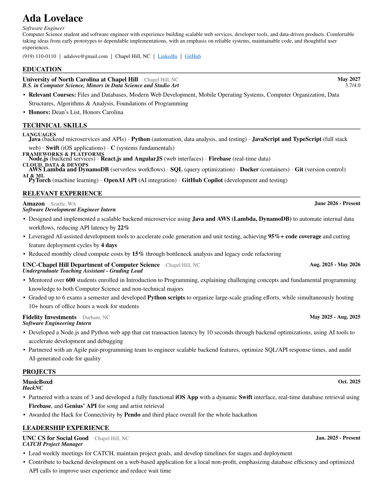

# Simple Resume

A compact Typst resume template with a traditional, single-column layout.



## Usage

```typst
#import "@local/simple-resume:0.5.1": resume, entry, skills

#show: resume.with(
  name: "Ada Lovelace",
  tagline: "Software Engineer",
  summary: [
    Computer Science student focused on reliable systems and thoughtful user
    experiences.
  ],
  phone: "+1 555 0100",
  email: "ada@example.com",
  address: "London, UK",
  links: (link("https://example.com")[Portfolio],),
  photo: none,
  photo-size: (width: 0.82in, height: 0.92in),
)

= Education

#entry(
  title: [University of London],
  location: [London, UK],
  date: [May 2027],
  subtitle: [B.S. in Computer Science],
  grade: [First Class Honours],
)

= Technical Skills

#skills(
  (
    category: [Languages],
    technologies: (
      (
        technology: [Java],
        scope: [backend services and APIs],
      ),
      (technology: [Python], scope: [automation and data analysis]),
    ),
  ),
  (
    category: [Cloud & DevOps],
    technologies: (
      (technology: [AWS], scope: [Lambda and DynamoDB]),
      (technology: [Docker], scope: [containerized development]),
    ),
  ),
)
```

`tagline`, `summary`, and `photo` are optional. `photo` accepts content such as
`image("photo.jpg")` and is cropped to a bordered portrait without changing its
aspect ratio. Adjust the portrait frame with `photo-size`, for example
`(width: 1in, height: 1.12in)`.

Use `entry` for education, experience, projects, and leadership. `title` and
`date` are required; `subtitle`, `location`, and `grade` are optional. Omit
`grade` when it is not relevant. Sections and descriptions use regular Typst
content.

Use `skills` for compact, ATS-friendly technical skill groups. Each group
requires `category` and one or more `technologies`. Each technology requires a
`technology` name and a practical `scope`. The block uses stacked categories in
a single-column reading order rather than tables, icons, or rating graphics.
